[toc]

# CS61B-sp18

Personal Solutions for CS 61B Data Structures, Spring 2018

## Hibbard Deletion

Deleting from a BST: Deletion with two Children (Hibbard)

e.g.:

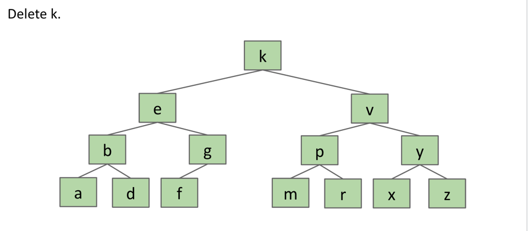

find two numbers adjacent to k(g < k and m > k ),we choose g.

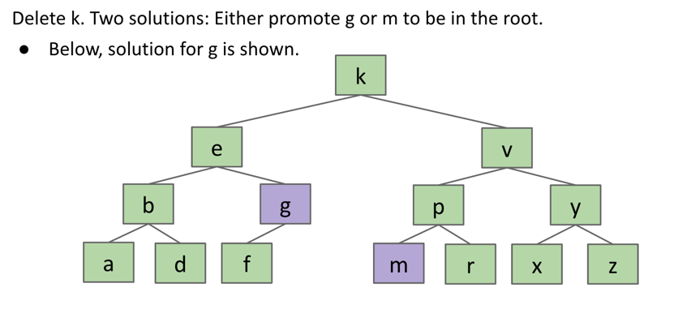

g -> k and f -> g

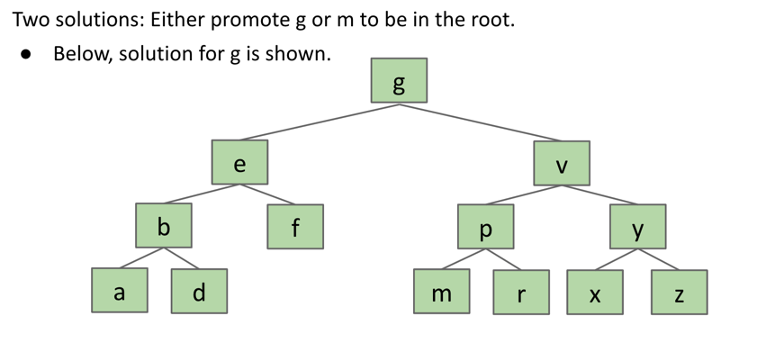

## B-Tree

> B-Tree: Balance Tree, Not Binary Tree
> 
> B-trees of order L=3 (like we used today) are also called a 2-3-4 tree or a 2-4 tree.

The process of adding a node to a 2-3-4 tree :

1. We still always inserting into a leaf node, so take the node you want to insert and traverse down the tree with it, going left and right according to whether or not the node to be inserted is greater than or smaller than the items in each node.
2. After adding the node to the leaf node, if the new node has 4 nodes, then pop up the middle left node and re-arrange the children accordingly. 
3. If this results in the parent node having 4 nodes, then pop up the middle left node again, rearranging the children accordingly.
4. Repeat this process until the parent node can accommodate or you get to the root.

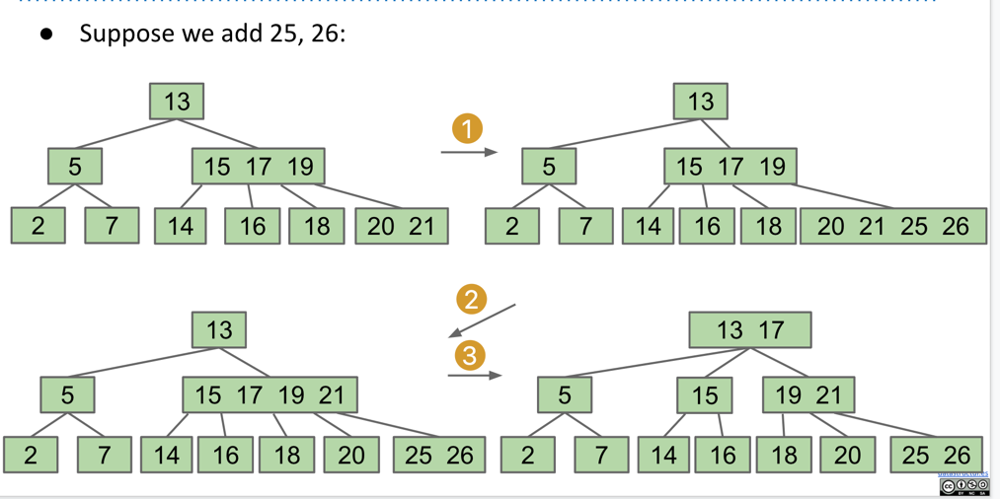

What Happens If The Root Is Too Full?

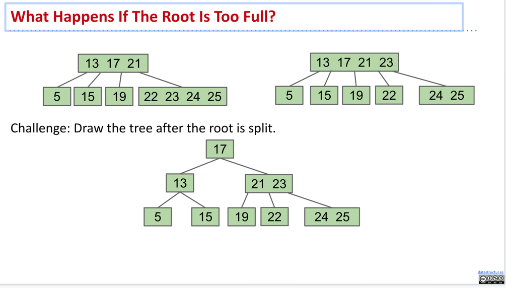

这个 [网站](https://www.cs.usfca.edu/~galles/visualization/BTree.html) 可以可视化演示BTree的插入和删除过程。

## Red Black Tree
### Tree Rotation

rotateRight(P)： Let x be the left child of P. Make P the **new right child** of x.

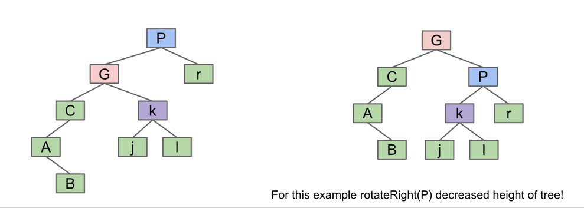
### Left-Leaning Red Black Binary Search Tree (LLRB)

上面介绍的两种树：

- BST：容易实现，但是难以保持平衡
- B-tree：可以保持平衡，但是难以实现

我们可以结合两者的优点，建造一种**结构上类似B-tree的BST**

Question：How to build a BST that is structurally identical to a not unbalanced 2-3 tree?

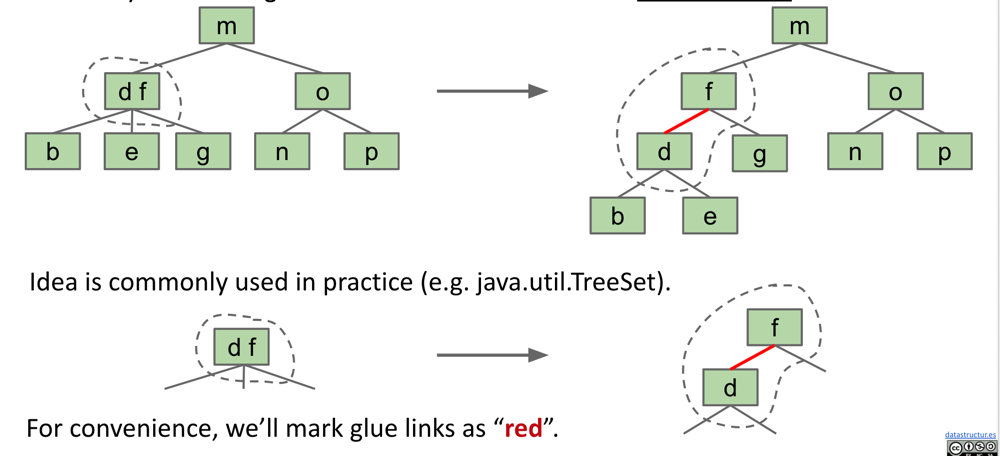

>A BST with **left glue** links that represents a 2-3 tree is often called a 『Left Leaning Red Black Binary Search Tree』 or LLRB.
>- LLRBs are normal BSTs!
>- There is a 1-1 correspondence between an LLRB and an equivalent 2-3 tree.
>- The red is just a convenient fiction. Red links don’t “do” anything special.

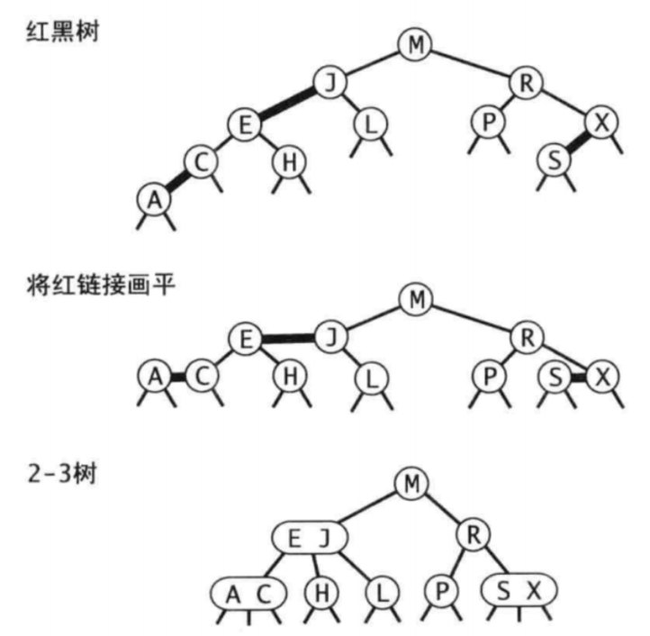
**LLRB properties:**
- No node has two red links [otherwise it’d be analogous to a 4 node, which are disallowed in 2-3 trees].
- Every path from root to a leaf has same number of black links [because 2-3 trees have the same number of links to every leaf]. LLRBs are therefore balanced.

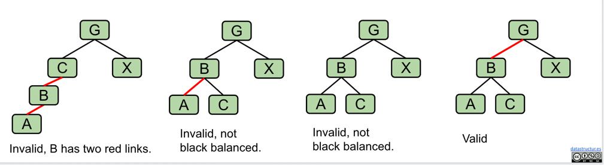

### Insertion rules

1. 插入新结点的链接默认为红色
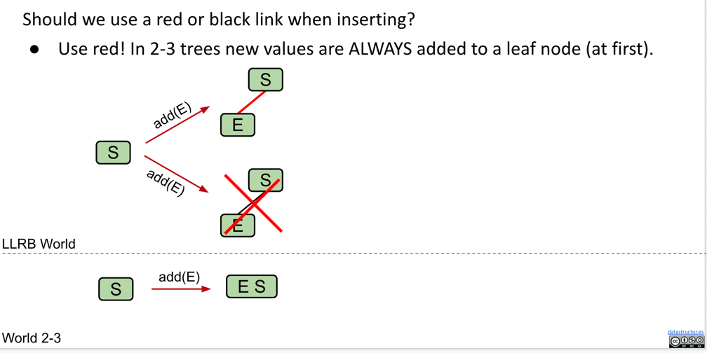
2. 如果出现右倾红链接，左旋转其结点
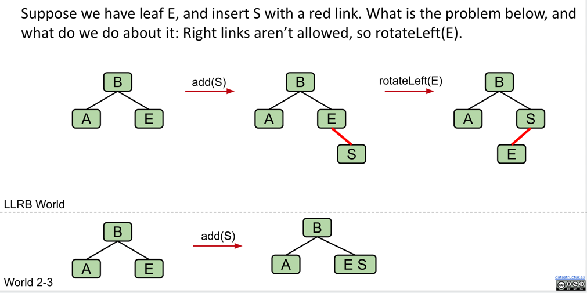
3. 如果出现连续两条红色左链接，右旋转其结点
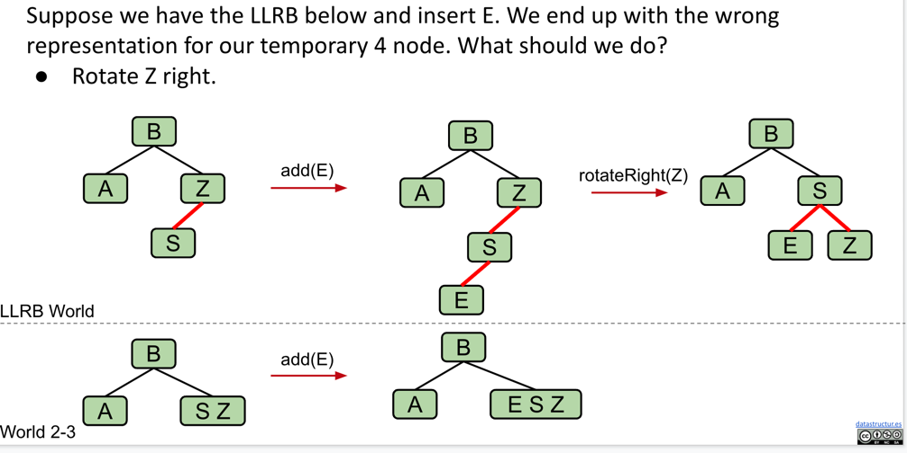
4. 允许结点**暂时**含有左右两条红链接，之后翻转将子结点变黑，父结点变红(没有父结点，只变子结点即可)
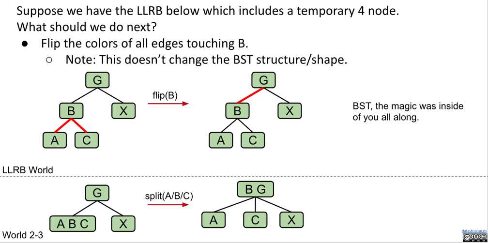

## Heaps and Priority Queues

We will define our binary min-heap as being **complete** and obeying **min-heap** property:

- Min-heap: Every node is less than or equal to both of its children

- Complete: Missing items only at the bottom level (if any), all nodes are as far left as possible.

  

  

